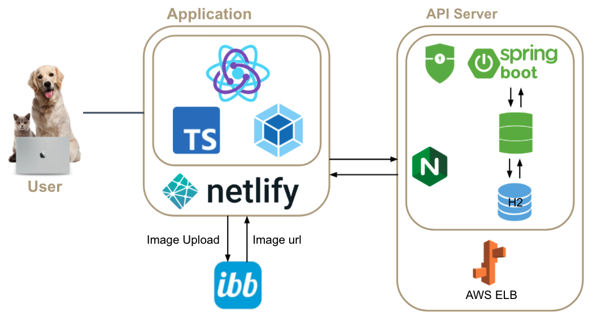

# minipetpee-backend

2021.07 ~ 2021.09

## 서비스 소개

- 싸이월드 느낌의 펫 소셜 네트워크 서비스
- 반려동물 전용 미니홈피

## 팀 소개

- 정윤정(팀장) [@cyj199637](https://github.com/cyj199637)
- 김나연 [@nayeonkim](https://github.com/nayeonkiim)
- 구다희 [@dadahee](https://github.com/dadahee)

## 기능

- 메인: 인기글 / 게시글 검색 / 회원 검색
- 회원: 온보딩 / 마이페이지 / 커스텀 프로필
- 홈피: 프로필 / 대문사진 / 최신 게시글 / 방문자수 / 공생평(일촌평)
- 방명록: 공개 여부 설정 가능
- 앨범 & 게시글: 공개 여부 설정 가능 / 덧글 / 사진 업로드
- 스타 & 팬: 팔로잉, 팔로우 / 목록 확인

## 서비스 아키텍쳐

## 기술 스택

Spring boot, Spring Data JPA, Spring Security, Swagger, H2, AWS ELB

## DataBase Modeling

## 프로젝트 관리 문서

- [협업 규칙](docs/rule/cooperation_rules.md)
- [기능 명세서](docs/functional_spec/기능_명세서.pdf)
- [API 설계](docs/api/design)
- [API 명세서 (Swagger)](docs/api/spec)
